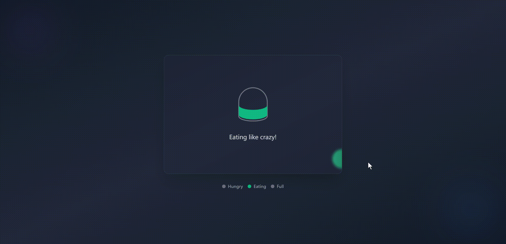

# Boring Eating State Simulator

A relaxing and interactive web animation that simulates different eating states through a playful bowl interface.

## Overview

The Boring Eating State Simulator is a fun, interactive web animation that takes you through different eating states. Watch as the bowl fills up and emotions change through various states: hungry, eating, and full. This project combines smooth animations, interactive elements, and a calming visual experience.

## Features

- **Three Distinct States:**
  - 🍽️ Hungry: Experience the anticipation with an empty bowl
  - 🍜 Eating: Watch the bowl fill up with a satisfying wave animation
  - 😊 Full: See the contentment with a happy face and full bowl

- **Interactive Elements:**
  - Mouse trail effects that change color based on the current state
  - Smooth animations and transitions
  - Click interactions to progress through states

- **Customization Options:**
  - Auto-cycle feature for continuous animation
  - Fullscreen mode for an immersive experience
  - Settings panel for user preferences

## Technical Highlights

- Built with pure HTML, CSS, and JavaScript
- Utilizes Tailwind CSS for styling
- Smooth animations using CSS keyframes
- Responsive design that works across devices
- Local storage integration for user preferences

## Usage

1. Click the utensils icon to start the eating simulation
2. Watch as the bowl progresses through different states
3. Use the settings panel to customize your experience
4. Toggle fullscreen mode for better immersion
5. Click the refresh icon to restart the simulation

## Installation

No installation required! Simply open the `index.html` file in a modern web browser to start using the simulator.

## Browser Support

- Chrome (recommended)
- Firefox
- Safari
- Edge

## Contributing

Feel free to submit issues and enhancement requests!

## License

MIT License - feel free to use this project for your own purposes.

## Credits

Created by Trae - A fun project to explore web animations and interactive states.

---

Enjoy watching the eating states change and relax with this simple yet engaging animation!
